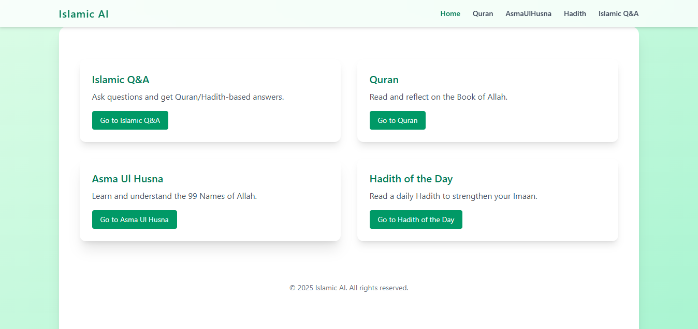

# 🕌 Islamic UI Template – React + Tailwind CSS

A modern, reusable Islamic UI template built using **React** and **Tailwind CSS**. Perfect for building Islamic apps such as Hadith viewers, Quran apps, prayer time apps, and more.

## 🌟 Features

- ✅ **Hadith of the Day** (Random Hadith using Hadith API)
- ✅ **Reusable Card Component**
- ✅ **Responsive Layout** (Mobile + Desktop)
- ✅ Built with **React + Tailwind CSS**
- ✅ Easy to customize and extend
- ✅ Clean folder structure
- ✅ API ready with `.env` support
- ✅ Includes Urdu and English Hadith content
- 🧱 Template structure – perfect for rapid Islamic app development

---

## 📸 Screenshots


_(Add a screenshot here in `public\preview.png` folder)_

---

## 🚀 Demo

Live demo: [your-demo-link.com](https://your-demo-link.com)

---

## 📦 Getting Started

### 1. Clone the repository

```bash
git clone https://github.com/bilalkhan35/islamic-ui-template.git
cd islamic-ui-template
```
